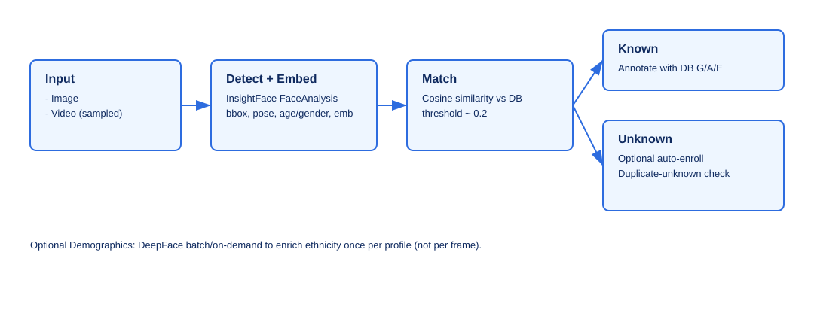
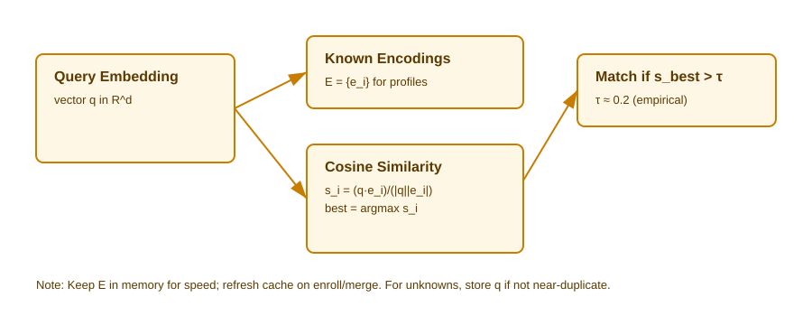

# Sentinel-Sec Architecture and Computer Vision Pipeline

This document explains the overall architecture, the computer vision pipeline, the database schema, and how the Streamlit frontend integrates with the backend. It also links to relevant research papers and resources for deeper learning.

## Overview

Sentinel-Sec is a face recognition security system with:
- InsightFace for fast detection and embeddings (FaceAnalysis / buffalo_l)
- Optional DeepFace for demographics (age/gender/ethnicity) offline or on-demand
- SQLite database for profiles, encodings, and detections
- A Streamlit web app for dashboarding, media uploads, live detection, analytics, and profile management

## Architecture

- lib/
  - face_detector.py: Wraps InsightFace FaceAnalysis. Provides detection, embeddings, landmarks, pose, visualization helpers.
  - face_analyzer.py: Uses DeepFace for demographics (age, gender, race/ethnicity) when needed.
  - database.py: DatabaseManager class for SQLite CRUD operations (profiles, encodings, detections). Includes merge helpers.
- src/
  - video_auto_enroll.py: Standalone CLI pipeline for batch/video processing and auto-enrolling new faces.
  - sentinel.py: Streamlit app (Dashboard, Upload & Process, Manage Profiles, Analytics, Live Detection, Documentation).
- docs/
  - ARCHITECTURE.md: This file.

Architecture overview diagram:

<p align="center">
  
  <br />
  <sub>High-level components and data flow.</sub>
  <br /><br />
</p>

## Database Schema (SQLite)

Tables:
- profiles(id, name, created_at, last_seen, gender, age_range, ethnicity, notes)
- face_encodings(id, profile_id, encoding BLOB, angle)
- detections(id, profile_id, timestamp, confidence, angle, image_path)

Key ideas:
- A profile can have multiple encodings (different angles/conditions).
- Detections log presence over time with optional snapshot paths.

## Computer Vision Pipeline

1) Detection and Embedding (InsightFace):
- Load FaceAnalysis (buffalo_l) with GPU if available, else CPU.
- app.get(frame) returns faces with bbox [x1,y1,x2,y2], kps (landmarks), pose (yaw,pitch,roll), age, gender, and embedding.
- We clamp bbox to image bounds to avoid drawing artifacts.

2) Matching (Cosine Similarity):
- Cache DB encodings in memory.
- Given a query embedding, compute cosine similarity to all known encodings; if best score > threshold (~0.2), treat it as a match.
- If matched, annotate with profile DB demographics (G/A/E).

3) Auto-enroll Unknowns (optional):
- For unknown faces not near-duplicates of previously seen unknowns in the session, create a new profile, store embedding, save snapshot, and record detection.
- This behavior mirrors `video_auto_enroll.py` and is toggleable in the WebApp.

4) Demographics (DeepFace, optional):
- For performance, rely on InsightFace for age/gender estimates during live/interactive flows.
- Optionally, run DeepFace batch analysis (age/gender/race) offline or on-demand for better ethnicity estimation.

Pipeline flow diagram:

<p align="center">
  
  <br />
  <sub>End-to-end flow from input to annotation and auto-enroll.</sub>
  <br /><br />
</p>

## Streamlit Frontend

- Dashboard: totals, recent detections, timeline, top profiles, and demographics distributions.
- Upload & Process: image or video; shows overlays; auto-enroll toggle; progress and FPS for video; saves snapshots.
- Manage Profiles: list, search, snapshots gallery, merge (into existing or create new), create with upload, edit fields.
- Analytics: demographics charts and presence timeline.
- Live Detection: webcam loop with overlays and matching.
- Documentation: renders this file within the app.

## Data Flow

- Profiles/Encodings/Detections <- DatabaseManager <- UI actions or video_auto_enroll pipeline.
- Matching cache: profiles + encodings loaded into memory for fast similarity checks.
- Snapshots: stored in database_db/added_faces and referenced by detections.image_path.

## Error Modes and Edge Cases

- No GPU: runs on CPU, slower but functional.
- Big images or long videos: use progress bar and FPS display; sample frames (e.g., every 30th frame) to trade speed/coverage.
- No faces detected: UI shows messages; ensure images are RGB when displaying.
- Duplicate unknowns: prevent by checking cosine similarity against previously seen unknown embeddings in the session.

## Matching Details

Cosine-similarity matching details:

<p align="center">
  
  <br />
  <sub>We cache encodings in memory and compute cosine similarity; best above threshold is considered a match.</sub>
  <br /><br />
</p>

## Research and References

- InsightFace: https://github.com/deepinsight/insightface
  - Paper: ArcFace: Additive Angular Margin Loss for Deep Face Recognition (https://arxiv.org/abs/1801.07698)
- FaceAnalysis (buffalo_l model zoo): https://github.com/deepinsight/insightface/tree/master/model_zoo
- DeepFace: https://github.com/serengil/deepface
  - DeepFace Demography Docs: https://github.com/serengil/deepface#facial-attribute-analysis
- On embeddings and similarity:
  - FaceNet (Schroff et al., 2015): https://arxiv.org/abs/1503.03832
  - Cosine similarity overview: https://en.wikipedia.org/wiki/Cosine_similarity
- Pose estimation in face analysis: related approaches using facial landmarks and head pose estimation.

### Figures from Papers (attribution)

You can include figures/GIFs from the referenced papers for educational purposes. Ensure you follow each paper's license and attribution guidelines. Place assets under `docs/assets/` and embed them like:

```html
<p align="center">
  
  <br />
  <sub>Figure credit: authors of the referenced paper (link). Used for educational documentation.</sub>
</p>

## Demos & Links

- ArcFace Demo (YouTube): https://www.youtube.com/watch?v=y-D1tReryGA

<p align="center">
  <iframe width="720" height="405" src="https://www.youtube.com/embed/y-D1tReryGA" title="ArcFace Demo" frameborder="0" allow="accelerometer; autoplay; clipboard-write; encrypted-media; gyroscope; picture-in-picture; web-share" allowfullscreen></iframe>
  <br />
  <sub>If the iframe does not render, use the link above.</sub>
</p>

- DeepFace GitHub: https://github.com/serengil/deepface
```

Suggested figures/GIFs to add (placeholders):
- ArcFace pipeline or margin illustration (from the ArcFace paper)
- InsightFace FaceAnalysis diagram from the model zoo docs
- DeepFace attribute analysis sample visualization

Store them as `svg`, `png`, or `gif` under `docs/assets/` and reference with relative paths so they render inside the Streamlit app.

Example embedded (placeholder):

<p align="center">
  
  <br />
  <sub>Placeholder 1x1 GIF — replace with an actual figure from the paper with proper attribution and license compliance.</sub>
</p>

## Code Snippets (How-To)

Below are concise, copyable examples showing how core pieces fit together. These mirror what the app does under the hood.

### Detect faces and get embeddings (InsightFace)

```python
import os, sys, cv2
import numpy as np

# Ensure repo root on path when running from docs/ or notebooks
ROOT = os.path.abspath(os.path.join(os.getcwd()))
if os.path.basename(ROOT).lower() != 'sentinel-sec':
  # adjust if running from a subfolder
  ROOT = os.path.abspath(os.path.join(os.getcwd(), '..'))
sys.path.append(ROOT)

from lib.face_detector import FaceDetector, create_test_image

# Optional: model cache directory
os.environ['INSIGHTFACE_HOME'] = os.path.join(ROOT, 'models')

detector = FaceDetector()
image = create_test_image()  # or cv2.imread('path/to/image.jpg')
faces = detector.process_frame(image)
print(f"Detected {len(faces)} face(s)")
for i, face in enumerate(faces):
  emb = face['embedding']
  print(f"Face {i+1}: embedding shape = {emb.shape}, yaw≈{float(face['pose'][0]) if face.get('pose') is not None else 0:.1f}")
```

### Cosine similarity matching (threshold ≈ 0.2)

```python
import numpy as np

def batch_cosine_similarity(embedding, embeddings):
  embedding = embedding.astype(np.float32)
  embeddings = np.array(embeddings, dtype=np.float32)
  if embeddings.ndim == 1:
    embeddings = embeddings.reshape(1, -1)
  dot = np.dot(embeddings, embedding)
  norm_emb = np.linalg.norm(embeddings, axis=1)
  norm_query = np.linalg.norm(embedding)
  return dot / (norm_emb * norm_query + 1e-8)

query = faces[0]['embedding']
known_encodings = [f['embedding'] for f in faces[1:]]  # demo: pretend others are known
scores = batch_cosine_similarity(query, known_encodings) if known_encodings else np.array([])
if scores.size:
  best = float(scores.max()); idx = int(scores.argmax())
  print(f"Best cosine score: {best:.3f} @ index {idx} -> {'MATCH' if best > 0.2 else 'unknown'}")
else:
  print("No known encodings to compare against.")
```

### Enroll a new profile and save a snapshot

```python
import os, cv2
from lib.database import DatabaseManager

db_path = os.path.join(ROOT, 'database_db', 'face_profiles.db')
db = DatabaseManager(db_path=db_path)

# Create profile
pid = db.add_profile(name="Unknown_1", gender="Unknown", age_range="Unknown", ethnicity="Unknown", notes="Workshop demo")

# Add encoding (use yaw from pose if available)
face0 = faces[0]
yaw = float(face0.get('pose', [0])[0]) if face0.get('pose') is not None else 0.0
db.add_face_encoding(pid, face0['embedding'], angle=yaw)

# Save a cropped snapshot and record detection
added_dir = os.path.join(os.path.dirname(db_path), 'added_faces')
os.makedirs(added_dir, exist_ok=True)
x1,y1,x2,y2 = map(int, face0['bbox'])
crop = image[y1:y2, x1:x2]
snap_path = os.path.join(added_dir, f"face_{pid}.jpg")
if crop.size > 0:
  cv2.imwrite(snap_path, crop)
db.record_detection(pid, confidence=float(face0.get('det_score', 0.0)), angle=int(yaw), image_path=snap_path)
print(f"Enrolled PID={pid} and saved snapshot to {snap_path}")
```

### Prevent duplicate unknowns during auto-enroll

```python
def is_duplicate_unknown(embedding, all_unknown_embeddings, threshold=0.2):
  if len(all_unknown_embeddings) == 0:
    return False
  scores = batch_cosine_similarity(embedding, np.array(all_unknown_embeddings))
  return bool(np.any(scores > threshold))

unknown_cache = []
for f in faces:
  emb = f['embedding']
  if not is_duplicate_unknown(emb, unknown_cache):
    unknown_cache.append(emb)
```

### Quick presence timeline with pandas/plotly

```python
import pandas as pd
import plotly.express as px

det = pd.DataFrame(db.get_detections(limit=1000))
if not det.empty and 'timestamp' in det.columns:
  det['timestamp'] = pd.to_datetime(det['timestamp'], errors='coerce')
  fig = px.scatter(det.dropna(subset=['timestamp']), x='timestamp', y='profile_id', color='profile_id', title='Detections Over Time')
  fig.show()
```

### Optional: Demographics with DeepFace

```python
from lib.face_analyzer import FaceAnalyzer

analyzer = FaceAnalyzer()
attrs = analyzer.analyze_face(face0['face_img'])
print(attrs)  # {'age': '...', 'gender': '...', 'ethnicity': '...'}
```

## YouTube and Learning Resources

- InsightFace tutorials and demos: search “InsightFace FaceAnalysis” on YouTube.
- DeepFace walkthroughs: search “DeepFace Python tutorial”.
- Streamlit basics for CV apps: https://docs.streamlit.io and YouTube channels covering Streamlit computer vision projects.

## Future Work

- Batch ethnicity analysis task to populate DB more accurately in background.
- Richer analytics (heatmaps, per-camera streams, per-hour presence).
- Multi-camera live view and recording integration.
- Improved UI/UX for large images and multi-face merging workflows.
